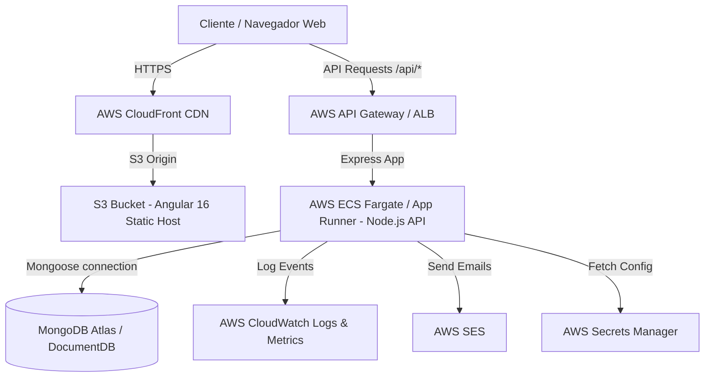

# 📐 Documento de Análisis Técnico, Diagnóstico e Infraestructura (Alto Porte)

Este documento detalla el análisis técnico completo requerido en las secciones 4, 6, 7 y 8 de la evaluación de **Alto Porte**, cubriendo optimización de MongoDB a escala de millones de registros, diagnóstico paso a paso de incidentes de producción, propuesta de arquitectura en Amazon Web Services (AWS), plan de migración sin downtime y matriz de controles de seguridad.

---

## 📊 1. Base de Datos: MongoDB y Aggregation Pipeline

### 1.1 Estrategia de Índices para 2 Millones de Documentos

Con 2,000,000 de documentos, ejecutar filtros y agregaciones sin índices adecuados causa escaneos completos de colección (_COLLSCAN_), elevando el consumo de CPU y memoria RAM y generando tiempos de respuesta superiores a los 10 segundos.

Se definieron e implementaron los siguientes índices compuestos y sencillos siguiendo la regla **ESR** (_Equality, Sort, Range_):

1. **Índice Compuesto Principal (Filtro por Estado + Orden Fecha)**:

   ```javascript
   db.leads.createIndex({ status: 1, createdAt: -1 })
   ```

   El listado y dashboard filtran frecuentemente por `status` y ordenan los registros por la fecha de creación descendente.

2. **Índices Compuestos Secundarios (Fuente y Proyecto)**:

   ```javascript
   db.leads.createIndex({ source: 1, createdAt: -1 })
   db.leads.createIndex({ project: 1, createdAt: -1 })
   ```

   Acelera las consultas filtradas por canal de captura u emprendimiento inmobiliario específico.

3. **Índice Sencillo de Presupuesto**:

   ```javascript
   db.leads.createIndex({ budget: -1 })
   ```

   Optimiza las consultas ordenadas por monto de inversión inmobiliaria.

4. **Índice de Texto para Búsqueda**:
   ```javascript
   db.leads.createIndex({ name: 'text', email: 'text' })
   ```
   Permite búsquedas rápidas por coincidencia de texto sin requerir evaluaciones complejas de expresiones regulares `$regex` que no aprovechan índices B-Tree.

---

### 1.2 Identificación de Consultas Lentas en Aggregation Pipeline

Para identificar pipelines con problemas de rendimiento:

1. **Uso de `.explain("executionStats")`**:
   Permite analizar el plan de ejecución de la consulta. Se verifican métricas clave:
   - `totalDocsExamined` vs `nReturned`: Si se examinan 2,000,000 de documentos para retornar 10, la consulta carece de un índice adecuado.
   - `stage`: Garantizar que el escenario ejecute `IXSCAN` (Scan de índice) en lugar de `COLLSCAN`.
2. **MongoDB Profiler y Slow Query Logs**:
   Activar el profiler de MongoDB para registrar cualquier operación que supere los 100 milisegundos:
   ```javascript
   db.setProfilingLevel(1, { slowms: 100 })
   ```
3. **Métricas en MongoDB Atlas / CloudWatch**:
   Monitorear el _Query Targeting Ratio_ (relación de documentos escaneados vs retornados) e IOPS de lectura en disco.

---

### 1.3 Acciones si el Dashboard Tardara Varios Segundos

Si el endpoint `GET /api/dashboard/summary` se degrada debido al volumen de datos:

1. **Optimización con `$match` Temprano**:
   Ubicar la etapa `$match` al inicio del pipeline para reducir drásticamente los documentos procesados por `$group` y aprovechar índices.
2. **Vistas Materializadas o Colección de Pre-Agregación (`$merge`)**:
   Implementar un proceso en segundo plano (cronjob o triggers con MongoDB Change Streams) que calcule métricas por hora/día y persista el resultado en una colección `dashboard_summaries`.
3. **Capa de Caché con Redis**:
   Almacenar la respuesta JSON del resumen en un clúster de Redis con un tiempo de vida (_TTL_) de 5 a 10 minutos. La respuesta se servirá en < 5ms directamente desde memoria RAM.

---

### 1.4 Embebidos vs Referencias entre Colecciones

| Criterio        | Documentos Embebidos                                                                                             | Referencias entre Colecciones (`$lookup` / ID)                                                                   |
| :-------------- | :--------------------------------------------------------------------------------------------------------------- | :--------------------------------------------------------------------------------------------------------------- |
| **Cuándo usar** | Relaciones 1:1 o 1:N acotadas (ej. Historial de cambios de estado de un lead). Datos que siempre se leen juntos. | Relaciones N:M o 1:N de crecimiento indefinido (ej. Catálogo de Proyectos, Agentes de Venta, Logs de Auditoría). |
| **Ventajas**    | Operaciones de lectura atómicas en una sola consulta sin JOINs/`$lookup`.                                        | Evita la duplicación de datos y previene superar el límite BSON de 16MB por documento.                           |
| **Desventajas** | Duplicación de información si la entidad cambia (ej. actualización del nombre de un proyecto).                   | Requiere consultas adicionales o uso de `$lookup` que incrementa la latencia en grandes volúmenes.               |

---

## 🛠️ 2. Diagnóstico de un Incidente de Producción

### Escenario

_Los usuarios reportan que el dashboard, que antes cargaba casi de inmediato, ahora tarda entre 8 y 12 segundos._

---

### Procedimiento Diagnóstico Paso a Paso

#### Paso 1: Recopilación de Información Previa (Sin modificar código)

- **Verificar alcance del problema**: ¿Afecta a todos los usuarios o solo a un rol o volumen de datos específico?
- **Ventana temporal e historial**: Revisar si coincide con un despliegue de código reciente, incremento brusco de tráfico o migración de datos.
- **Estado de Infraestructura**: Consultar uso de CPU, RAM, red e IOPS en AWS CloudWatch y MongoDB.

#### Paso 2: Aislamiento del Cuello de Botella

Se evalúa capa por capa en dirección cliente-servidor:

1. **Frontend (Browser / Angular)**: Medir con Chrome DevTools (tab _Network_) la métrica **TTFB** (_Time to First Byte_). Si TTFB es de 10s, la demora está en el backend/base de datos; si TTFB es 50ms pero la interfaz se congela 10s, el problema es en el ciclo de detección de cambios de Angular.
2. **Backend (Node.js API)**: Revisar logs del servidor web (Express/APM) para confirmar el tiempo exacto de procesamiento en la ruta `/api/dashboard/summary`.
3. **Base de Datos (MongoDB)**: Ejecutar `db.currentOp()` para identificar operaciones bloqueantes o de larga duración.

#### Paso 3: Logs, Métricas y Herramientas Utilizadas

- **APM & Distributed Tracing**: AWS X-Ray o Datadog para visualizar la traza completa de la petición.
- **Node.js Diagnostics**: Medir bloqueo del _Event Loop_ con métricas de `libuv`.
- **MongoDB Tools**: `mongostat`, `mongotop` y consulta del _Slow Query Log_.

#### Paso 4: Identificación de Causa Raíz

- Confirmar si la lentitud responde a la falta de un índice tras el crecimiento de datos o a un escaneo completo de colección (_COLLSCAN_). Evitar aplicar reinicios a ciegas.

#### Paso 5: Validación de la Mejora y Prevención de Recurrencia

- **Validación**: Probar en un ambiente de Staging clonado con datos de volumen similar y ejecutar pruebas de carga (`k6` o `artillery`).
- **Prevención**: Configurar alertas automáticas en CloudWatch si el percentil 95 (p95) de la latencia supera los 800ms.

#### Paso 6: Comunicación a Stakeholders No Técnicos

- **Formato**: "Identificamos una lentitud en la generación del resumen comercial debido al aumento del volumen de datos almacenados. El equipo se encuentra aplicando una optimización en la base de datos para restaurar el tiempo de respuesta habitual a menos de 1 segundo. Estimamos la resolución completa en 45 minutos sin interrupción del servicio."

---

## ☁️ 3. AWS y Estrategia de Migración

### Evaluación de Servicios AWS Propuestos

1. **S3 y CloudFront (Frontend Angular)**:
   - _Decisión_: **Recomendado**. Permite alojar el build estático de Angular en S3 y distribuirlo globalmente a través de la CDN CloudFront con costo casi nulo, alta disponibilidad y certificados SSL gratuitos via AWS ACM.
2. **Elastic Beanstalk / Serverless / ECS Fargate (Backend Node.js)**:
   - _Decisión_: **ECS Fargate o App Runner** (Alternativa superior a Beanstalk por contenerización nativa Docker y auto-escalado ágil). Para tráfico impredecible, Serverless con AWS Lambda + API Gateway es válido.
3. **Amazon SES (Correos Transaccionales)**:
   - _Decisión_: **Recomendado**. Servicio de alto delivery rate y bajo costo para notificaciones por correo de nuevos leads.
4. **IAM (Gestión de Accesos y Secretos)**:
   - _Decisión_: **Recomendado**. Uso de roles IAM para otorgar permisos mínimos (_Principle of Least Privilege_) y AWS Secrets Manager para variables de entorno sensibles.
5. **AWS CloudWatch (Logs y Monitoreo)**:
   - _Decisión_: **Obligatorio**. Centralización de logs de aplicación, alarmas de uso de recursos e integración con CloudWatch Alarms.
6. **Estrategia de Backups para MongoDB**:
   - _Decisión_: Si se utiliza **MongoDB Atlas en AWS**, activar _Continuous Backups_ con _Point-in-Time Recovery_ (PITR). Si es autogestionado en EC2, programar snapshots de volumen EBS y exportaciones periódicas a S3 cifrado.

---

### Diagrama de Arquitectura Propuesta (Mermaid)



---

### Plan de Migración sin Downtime

- **Antes de la Migración**:
  - Inventariar repositorios, dependencias, variables de entorno y certificados.
  - Configurar infraestructura AWS mediante Infraestructura como Código (Terraform/CloudFormation).
  - Reducir el TTL de los registros DNS actuales a 300 segundos.
- **Durante la Migración**:
  - Desplegar frontend y backend en la nueva infraestructura AWS.
  - Sincronizar la base de datos actual hacia MongoDB AWS usando replicación en tiempo real o ventana de mantenimiento programada.
  - Ejecutar pruebas de humo (_Smoke Tests_) utilizando URLs temporales.
  - Actualizar los registros DNS hacia la CDN de AWS CloudFront.
- **Después de la Migración**:
  - Monitorear el tráfico entrante en CloudWatch y verificar ausencia de errores HTTP 5xx.
  - Revocar accesos y credenciales de las cuentas del proveedor anterior.
- **Plan de Rollback**:
  - Si ocurren fallos críticos en los primeros 30 minutos, modificar los registros DNS para que apunten nuevamente a la infraestructura anterior.

---

## 🔒 4. Seguridad, Pruebas y Criterio Técnico

### Matriz de Controles de Seguridad (Mínimo 6 Controles)

| Riesgo Identificado                                      | Medida Propuesta                                                                                            | Resultado Esperado                                                                                             |
| :------------------------------------------------------- | :---------------------------------------------------------------------------------------------------------- | :------------------------------------------------------------------------------------------------------------- |
| **Inyección NoSQL / Parameter Pollution**                | Sanitización estricta de entradas y validación de tipos mediante middlewares de Express.                    | Previene la alteración maliciosa de consultas MongoDB mediante objetos JSON inyectados.                        |
| **Fugas de Información por Excepciones No Controladas**  | Middleware de manejo centralizado de errores que abstrae el _stack trace_ en producción.                    | Respuestas de error estandarizadas JSON sin exponer detalles internos de la base de datos o sistema operativo. |
| **Ataques de Fuerza Bruta / DDoS en API**                | Configuración de Rate Limiting (`express-rate-limit`) por dirección IP en endpoints sensibles.              | Bloqueo automático de peticiones excesivas que intenten saturar el servidor API.                               |
| **Exposición de Credenciales Vía Control de Versiones**  | Uso de variables de entorno mediante `.env` cargadas desde AWS Secrets Manager y exclusión en `.gitignore`. | Ninguna contraseña, token o URI de conexión se almacena en el repositorio Git.                                 |
| **Ataques de Cross-Site Scripting (XSS) y Clickjacking** | Configuración de cabeceras HTTP de seguridad con `helmet` y políticas CORS restringidas por dominio.        | Protección del cliente ante la ejecución de scripts no autorizados o la incrustación en `iframes`.             |
| **Falta de Cifrado de Datos en Tránsito y en Reposo**    | Forzar protocolo HTTPS en CloudFront/ALB y activar cifrado TLS/AES-256 en MongoDB.                          | Garantiza la confidencialidad de la información personal de los leads comerciales.                             |

---

### Revisión Crítica

1. **¿Cuál considera que es el principal riesgo técnico de la solución entregada?**
   - El cálculo directo del dashboard mediante Aggregation Pipeline en la base de datos operacional. Aunque actualmente es rápido con pocos datos, si la colección supera el millón de registros sin caché o pre-agregación, impactará la CPU de MongoDB.

2. **¿Qué parte refactorizaría primero si tuviera un día adicional?**
   - Implementaría una capa de almacenamiento en caché con **Redis** para el endpoint `/api/dashboard/summary` y agregaría autenticación basada en **JWT / OAuth2** con roles de usuario.

3. **¿Qué decisión tomó por el límite de tiempo y cuál sería la alternativa ideal?**
   - Se optó por ejecutar las agregaciones en tiempo real vía `$facet`. La alternativa ideal para un entorno de alta escala es implementar arquitectura impulsada por eventos (_Event-Driven_) que actualice pre-calculados al insertar/modificar un lead.

4. **¿Qué monitoreo y alertas dejaría configurados para la primera semana en producción?**
   - Alerta de latencia HTTP p95 > 1000ms en el endpoint de dashboard.
   - Alerta de errores HTTP 5xx mayores al 1% del tráfico total.
   - Alerta de utilización de CPU > 80% en las instancias del backend o base de datos por más de 5 minutos.
